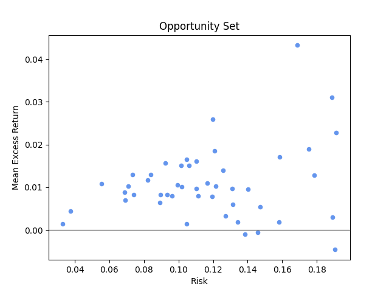
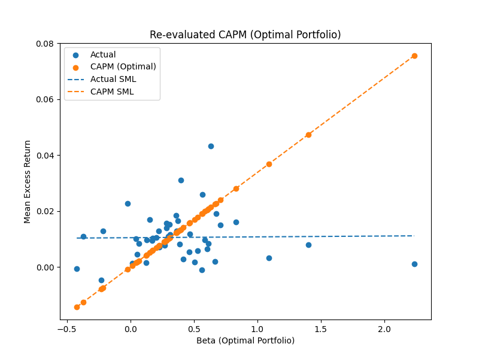
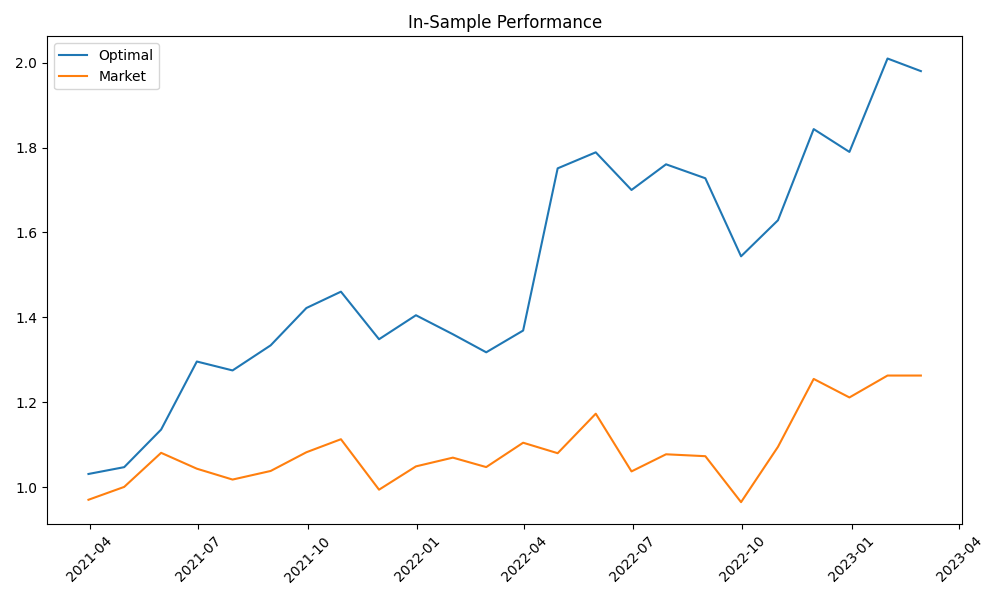

# CAPM Analysis & Portfolio Optimization

## Overview
This project investigates the relationship between risk and return using the Capital Asset Pricing Model (CAPM) and modern portfolio theory.

The analysis is applied to real financial data from Energy and Utilities sector stocks, combining econometric modeling and portfolio optimization techniques.

## Objectives
- Estimate CAPM parameters (alpha, beta) using regression analysis  
- Evaluate the Security Market Line (SML)  
- Analyze the relationship between beta and returns  
- Construct the Efficient Frontier  
- Identify optimal portfolios (Maximum Sharpe Ratio & Minimum Variance)  
- Examine the size effect  

## Dataset
The dataset consists of:
- Asset returns  
- Market capitalizations  
- Risk-free rate  

All data are aligned and processed to compute excess returns and portfolio weights.

## Methods

### Data Processing
- Time series alignment  
- Computation of monthly excess returns  
- Construction of value-weighted market portfolio  

### CAPM Estimation
CAPM is estimated using OLS regression:

Ri - Rf = α + β (Rm - Rf) + ε

Where:
- Ri = asset return  
- Rf = risk-free rate  
- Rm = market return  

### Security Market Line (SML)
- Comparison of actual vs CAPM-predicted returns  
- Linear regression of returns on beta  

### Portfolio Optimization
- Mean-variance framework  
- Efficient Frontier construction  
- Maximum Sharpe Ratio portfolio  
- Minimum Variance portfolio  

### Size Effect Analysis
- Assets grouped into deciles based on market capitalization  
- Regression of returns on size  

## Key Results

- CAPM fails to fully explain the relationship between risk and return  
- The Security Market Line shows a weak or negative slope  
- Portfolio optimization significantly improves performance  
- The size effect is not statistically significant  

## Visualizations

### Opportunity Set
<p align="center">
  
</p>

### Security Market Line
<p align="center">
  
</p>

### Efficient Frontier
<p align="center">
  
</p>

### Portfolio Performance
<p align="center">
  
</p>

## How to Run

```bash
pip install numpy pandas matplotlib scipy statsmodels openpyxl
python analysis.py
